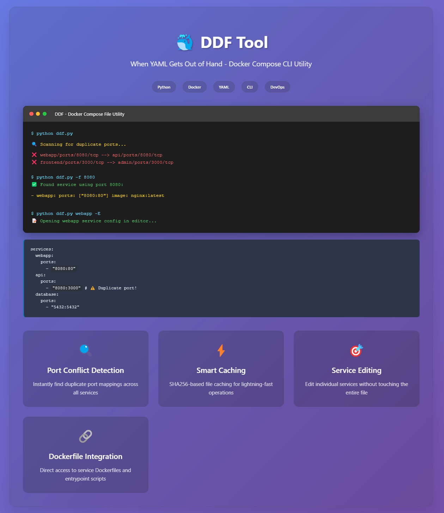

# DDF - Docker Compose File Utility

A powerful command-line utility for analyzing, managing, and editing Docker Compose files with rich terminal output and advanced features.

[](./screenshot.png)

## Features

- **Service Management**: List, view, edit, duplicate, copy, rename, remove, and create services
- **Port Analysis**: Find duplicate ports, check port usage across services
- **Resource Inspection**: View volumes, devices, hostnames, and port configurations
- **Dockerfile Integration**: Read, edit, copy, and set Dockerfiles associated with services
- **Entrypoint Management**: View and edit entrypoint scripts
- **File Management**: Read and edit files referenced in Dockerfile COPY commands
- **Rich Terminal Output**: Colorized syntax highlighting and formatted display
- **Pattern Matching**: Support for wildcards, regex, and substring matching for service names
- **File Caching**: Intelligent caching system for improved performance
- **Version Support**: Display script version from `__version__.py`

## Installation

### Prerequisites

- Python 3.6+
- Required Python packages:
  ```bash
  pip install pyyaml rich pydebugger configset rich-argparse clipboard
  ```

### Setup

1. Clone or download the `ddf.py` script
2. Make it executable (Linux/macOS):
   ```bash
   chmod +x ddf.py
   ```
3. Create a configuration file `ddf.ini` in the same directory (optional; auto-created if missing)
4. Add to your PATH for global access (optional)

## Configuration

Create a `ddf.ini` file in the same directory as `ddf.py`:

```ini
[docker-compose]
file = /path/to/your/docker-compose.yml
root_path = /path/to/your/project/root

[editor]
names = nvim,nano,vim
```

- `file`: Path to the default Docker Compose YAML file.
- `root_path`: Project root directory (defaults to `c:\PROJECTS` on Windows if exists, else current directory).
- `names`: Comma-separated list of preferred editors.

## Usage

### Basic Syntax

```bash
python ddf.py [service_name] [options]
```

### Command Options

| Option | Description |
|--------|-------------|
| `-c, --file FILE` | Path to Docker Compose YAML file |
| `-l, --list` | List ports for the specified service |
| `-d, --detail` | Show full configuration for the service |
| `-f, --find PORT` | Find which services use a specific port |
| `-p, --port PORT` | Check if a port is duplicated across services |
| `-D, --device` | Show devices for service(s) |
| `-vol, --volumes` | Show volumes for service(s) |
| `-P, --list-port` | List all ports for a service (same as `-l`) |
| `-L, --list-service-name` | List all service names, optionally with `-F` filter |
| `-r, --dockerfile` | Read and display Dockerfile for service |
| `-e, --edit-dockerfile` | Edit Dockerfile for service (creates new if missing) |
| `-sd, --set-dockerfile PATH` | Set Dockerfile path for service |
| `-E, --edit-service` | Edit service configuration |
| `-en, --entrypoint` | Read and display entrypoint script |
| `-ed, --edit-entrypoint` | Edit entrypoint script |
| `-cs, --copy-service` | Copy service configuration to clipboard |
| `-cd, --copy-dockerfile` | Copy Dockerfile content to clipboard |
| `-dd, --duplicate-service NEW_NAME` | Duplicate service with new name |
| `-rn, --rename-service NEW_NAME` | Rename service |
| `-rm, --remove-service` | Remove service from compose file |
| `-a, --all` | Show all services' details with `-f` |
| `-nl, --no-line-numbers` | Disable line numbers in syntax highlighting |
| `-hn, --hostname` | Show hostname(s) for service(s) |
| `-n, --new` | Create a new service |
| `-F, --filter PATTERN` | Filter services by regex, wildcard, or substring |
| `-v, --version` | Show script version |
| `-ef, --edit-file FILENAME` | Edit file referenced in Dockerfile COPY command |
| `-rf, --read-file FILENAME` | Read file referenced in Dockerfile COPY command |
| `--theme THEME` | Set syntax highlighting theme (default: fruity) |

### Examples

#### List all services
```bash
python ddf.py -L
```

#### Filter services by pattern
```bash
python ddf.py -L -F web* app
```

#### Show service details
```bash
python ddf.py webapp -d
```

#### Find duplicate ports
```bash
python ddf.py
```

#### Find services using port 8080
```bash
python ddf.py -f 8080
```

#### Check if port 3000 is duplicated
```bash
python ddf.py -p 3000
```

#### List ports for a service
```bash
python ddf.py webapp -l
```

#### Show volumes for services with "web" in name
```bash
python ddf.py web -vol
```

#### Show hostnames
```bash
python ddf.py webapp -hn
```

#### Edit a service configuration
```bash
python ddf.py webapp -E
```

#### Read Dockerfile for a service
```bash
python ddf.py webapp -r
```

#### Edit Dockerfile
```bash
python ddf.py webapp -e
```

#### Set Dockerfile path
```bash
python ddf.py webapp -sd ./custom/Dockerfile
```

#### Edit entrypoint script
```bash
python ddf.py webapp -ed
```

#### Read file from Dockerfile COPY
```bash
python ddf.py webapp -rf entrypoint.sh
```

#### Edit file from Dockerfile COPY
```bash
python ddf.py webapp -ef config.conf
```

#### Create a new service
```bash
python ddf.py new-service -n
```

#### Duplicate a service
```bash
python ddf.py webapp -dd webapp-staging
```

#### Rename a service
```bash
python ddf.py webapp -rn webapp-prod
```

#### Copy service to clipboard
```bash
python ddf.py webapp -cs
```

#### Copy Dockerfile to clipboard
```bash
python ddf.py webapp -cd
```

#### Remove a service
```bash
python ddf.py webapp -rm
```

#### Show version
```bash
python ddf.py -v
```

## Advanced Features

### Pattern Matching

DDF supports flexible service name matching:
- **Exact match**: `webapp`
- **Wildcard**: `web*` (matches webapp, webserver, etc.)
- **Substring**: `app` (matches webapp, myapp, etc.)
- **Regex**: Use with `-F` (e.g., `-F '^web.*$'`)

### Intelligent File Resolution

- Automatically locates Dockerfiles based on service build context
- Resolves entrypoint scripts from Dockerfile COPY instructions
- Supports relative and absolute paths
- Creates new Dockerfiles if missing when editing

### Rich Output

- Syntax-highlighted YAML, Dockerfile, and script content
- Colorized port conflict detection
- Formatted service listings with visual indicators

### Caching System

- File content caching based on SHA256 hashes
- Improved performance for repeated operations
- Automatic cache invalidation on file changes

## Configuration Details

### Default Paths

- Default Docker Compose file: `docker-compose.yml` in current directory or `c:\PROJECTS\docker-compose.yml`
- Default project root: `c:\PROJECTS` (if exists on Windows), else current directory
- Default editors: `nvim`, `nano`, `vim`

### Editor Priority

The utility tries editors in this order:
1. Custom editors from `ddf.ini`
2. `nano`
3. `nvim`
4. `vim`

## Error Handling

DDF provides comprehensive error handling for:
- Missing or invalid YAML files
- Non-existent services
- File permission issues
- Invalid port configurations
- Missing Dockerfiles or entrypoint scripts
- Editor availability

## Output Examples

### Duplicate Port Detection
```
webapp/ports/8080/tcp --> api/ports/8080/tcp
```

### Service Port Listing
```
Ports for service 'webapp':
  - 8080:80
  - 443:443
```

### Volume Display
```
webapp:
  volumes:
    - ./src:/app/src
    - ./logs:/var/log/app
```

### Hostname Display
```
- webapp: hostname: app.example.com
```

## Limitations

- Editor detection is platform-dependent
- Some features require specific Docker Compose file structures
- File paths in COPY commands must be resolvable relative to build context

## Contributing

1. Fork the repository
2. Create a feature branch
3. Make your changes
4. Test thoroughly
5. Submit a pull request

## License

This project is open source. Please check the license file for details.

## Support

For issues, feature requests, or questions:
1. Check existing documentation
2. Review error messages carefully
3. Ensure proper YAML syntax in Docker Compose files
4. Verify file permissions and paths

## Tips

- Use `-L` to list all services before working with specific ones
- Pattern matching is case-sensitive
- Always backup your Docker Compose files before editing
- Use the duplicate feature to create staging/development variants
- The clipboard copy feature is useful for sharing configurations
- Use `-F` with regex for precise service filtering

## Author
[Hadi Cahyadi](mailto:cumulus13@gmail.com)

[](https://www.buymeacoffee.com/cumulus13)

[](https://ko-fi.com/cumulus13)

[Support me on Patreon](https://www.patreon.com/cumulus13)